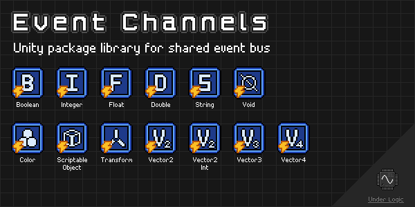

# Overview

Unity package library for sending and receiving events between components and across multiple scenes.

Heavily inspired by the infamous [Unite 2017: Game Architecture with Scriptable Objects](https://www.youtube.com/watch?v=raQ3iHhE_Kk) presentation by Ryan Hipple ([GitHub](https://github.com/roboryantron/Unite2017)).

Unfortunately Unity does not understand generics in the Editor and Inspectors, so only concrete types can be used.
Fortunately, this can be made easy by deriving from a single generic type allowing the same common behaviors.
